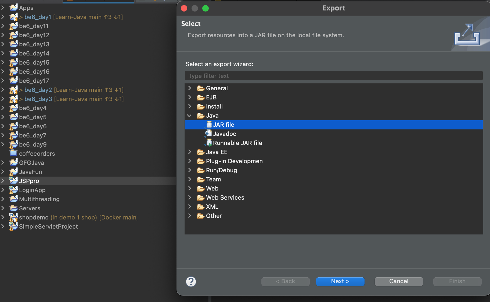
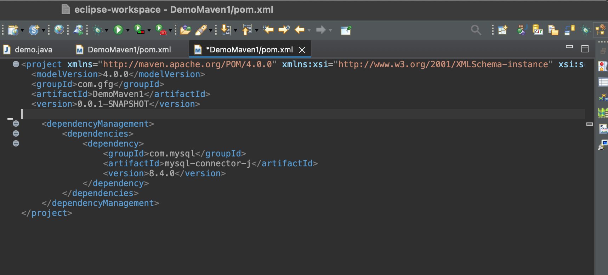

# JAVA-jar-maven

## JAR - JAVA ARCHIVE 

Jar can be created when you want to bundle all the classes you have so that you can reuse it somewhere. For example, we want to use classes in project named "Java oops" in other project named "java advance". We need to export jar from "Java oops" and import it in " Java advance"

1. Creating a Jar 
* STEP 1: 
(IntelliJ) File -> Project Structure -> Artifact -> + -> JAR
(Eclipse) Right-click on the project -> Export -> choose Export -> expand the 'Java' folder and select 'JAR file'



* STEP 2: 
(IntelliJ) "From modules with dependencies" -> select the module, e.g.,"Java oops"

(Eclipse) Choose the desired export options:
- Export generated class files and resources: include compiled .class files and resources in JAR
- Export Java source files and resources: include source files in JAR
- Compress the content of the JAR file: select to reduce the size of the JAR file
- Export class files with compile warnings: include class files even if they have compile warnings. 

* STEP 3:

(IntelliJ) Build -> Build Artifact Java OOPS: jar -> Action -> Build
(Eclipse) Jar manifest Specification: ensure the Geneerate the manifest file option is selected which contains metadata about the JAR file. Optionally, specify the Main class if your JAR is executable. This is the class with the main method. 

* STEP 4: in your out folder, now has a folder names "artifact" and jar folder underneath

2. Import a JAR

* STEP 1: 
(InteliJ) File -> Project Structure -> Modules -> dependencies -> + -> JAR -> select the 'Java oops' folder -> out -> artifact -> 'Java oops:jar" -> .jar file -> open -> apply
( eclipse) Right click on the project -> Properties -> Java Build path -> Libraries tab -> Add jars/ add external jars 

3. Disadvantages

* manual control: whatever you update in Java oops wont be reflected in jar file you imported in java advance project
* version conflict: have to go through create - import JAR process again and lost the previous version of JAR created

Hence, using JAR is only applicable for only source code that we own

## MAVEN

Maven is a dependency management tool. Maven has POM ( Project Object Model) to uniquely identify any project. Project identification include : 

1. Groupid : e.g., com.amazon - this is the package name
2. Artifact : automatically is your project name, but you can modify here. This is used as unique identifier for your project
3. Version: e.g., 1.0-SNAPSHOT

## MAVEN DEMO
1.  Create a Maven project in Eclipse 

- Create New -> Maven Project -> Select "Create a simple project ( skip archetype selection)
- Enter details for Group id, Artifact id, version and select jar as Packaging - used for projects that produce a JAR file which contains compiled Java classes, resources, and metadata files. JAR files are used to package Java application, libraries or modules for distribution or deployment. In contrast, WAR file is a packaged web app intended for deployment to servlet container or app server. It includes libraries, config files, and other assests required on top of web resoures, java classes to run a web app

2.  Create database name "maven" ( with docker) : 
```
docker ps 
docker exec -it container_ID mysql -u root -p
// ( enter the password for mysql, e.g., root)

show databases;
create database maven;
use maven
show tables;
```
3. Import mysql connector dependency from mvnrepository
(INTELIJ)
Go to mvnrepository and search for mysql --> paste the dependency to pom.xml -> maven will get this dependency for youin its central repository

```xml
<project xmlns="http://maven.apache.org/POM/4.0.0" xmlns:xsi="http://www.w3.org/2001/XMLSchema-instance" xsi:schemaLocation="http://maven.apache.org/POM/4.0.0 https://maven.apache.org/xsd/maven-4.0.0.xsd">
  <modelVersion>4.0.0</modelVersion>
  <groupId>com.gfg</groupId>
  <artifactId>DemoMaven1</artifactId>
  <version>0.0.1-SNAPSHOT</version>


<dependencies>
<!-- https://mvnrepository.com/artifact/com.mysql/mysql-connector-j -->
	<dependency>
	    <groupId>com.mysql</groupId>
	    <artifactId>mysql-connector-j</artifactId>
	    <version>8.4.0</version>
	</dependency>
</dependencies>

</project>
```
(ECLIPSE)
right click on project -> add dependencies -> enter groupid, artifact, version -> ok -> open pom.xml : sql dependency is automatically added




