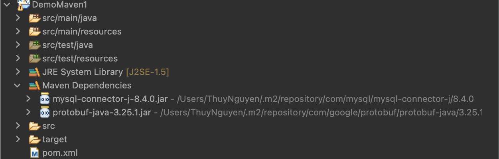
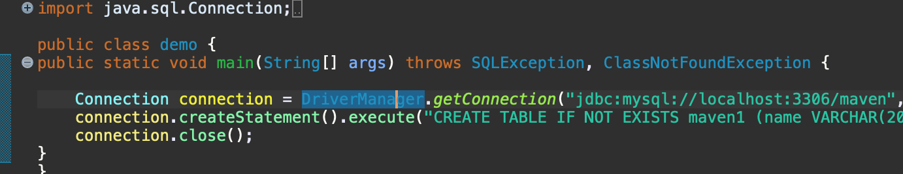

# JAVA-jar-maven

## JAR - JAVA ARCHIVE 

Jar can be created when you want to bundle all the classes you have so that you can reuse it somewhere. For example, we want to use classes in project named "Java oops" in other project named "java advance". We need to export jar from "Java oops" and import it in " Java advance"

1. Creating a Jar 
* STEP 1: 
(IntelliJ) File -> Project Structure -> Artifact -> + -> JAR
(Eclipse) Right-click on the project -> Export -> choose Export -> expand the 'Java' folder and select 'JAR file'


* STEP 2: 
(IntelliJ) "From modules with dependencies" -> select the module, e.g.,"Java oops"

(Eclipse) Choose the desired export options:
- Export generated class files and resources: include compiled .class files and resources in JAR
- Export Java source files and resources: include source files in JAR
- Compress the content of the JAR file: select to reduce the size of the JAR file
- Export class files with compile warnings: include class files even if they have compile warnings. 

* STEP 3:

(IntelliJ) Build -> Build Artifact Java OOPS: jar -> Action -> Build
(Eclipse) Jar manifest Specification: ensure the Geneerate the manifest file option is selected which contains metadata about the JAR file. Optionally, specify the Main class if your JAR is executable. This is the class with the main method. 

* STEP 4: in your out folder, now has a folder names "artifact" and jar folder underneath

2. Import a JAR

* STEP 1: 
(InteliJ) File -> Project Structure -> Modules -> dependencies -> + -> JAR -> select the 'Java oops' folder -> out -> artifact -> 'Java oops:jar" -> .jar file -> open -> apply
( eclipse) Right click on the project -> Properties -> Java Build path -> Libraries tab -> Add jars/ add external jars 

3. Disadvantages

* manual control: whatever you update in Java oops wont be reflected in jar file you imported in java advance project
* version conflict: have to go through create - import JAR process again and lost the previous version of JAR created

Hence, using JAR is only applicable for only source code that we own

## MAVEN

Maven is a dependency management tool. Maven has POM ( Project Object Model) to uniquely identify any project. Project identification include : 

1. Groupid : e.g., com.amazon - this is the package name
2. Artifact : automatically is your project name, but you can modify here. This is used as unique identifier for your project
3. Version: e.g., 1.0-SNAPSHOT

## MAVEN DEMO
1.  Create a Maven project in Eclipse 

- Create New -> Maven Project -> Select "Create a simple project ( skip archetype selection)
- Enter details for Group id, Artifact id, version and select jar as Packaging - used for projects that produce a JAR file which contains compiled Java classes, resources, and metadata files. JAR files are used to package Java application, libraries or modules for distribution or deployment. In contrast, WAR file is a packaged web app intended for deployment to servlet container or app server. It includes libraries, config files, and other assests required on top of web resoures, java classes to run a web app

2.  Create database name "maven" ( with docker) : 
```
docker ps 
docker exec -it container_ID mysql -u root -p
// ( enter the password for mysql, e.g., root)

show databases;
create database maven;
use maven
show tables;
```
3. Import mysql connector dependency from mvnrepository
(INTELIJ)
Go to mvnrepository and search for mysql --> paste the dependency to pom.xml -> maven will get this dependency for you in its central repository

```xml
<project xmlns="http://maven.apache.org/POM/4.0.0" xmlns:xsi="http://www.w3.org/2001/XMLSchema-instance" xsi:schemaLocation="http://maven.apache.org/POM/4.0.0 https://maven.apache.org/xsd/maven-4.0.0.xsd">
  <modelVersion>4.0.0</modelVersion>
  <groupId>com.gfg</groupId>
  <artifactId>DemoMaven1</artifactId>
  <version>0.0.1-SNAPSHOT</version>


<dependencies>
<!-- https://mvnrepository.com/artifact/com.mysql/mysql-connector-j -->
	<dependency>
	    <groupId>com.mysql</groupId>
	    <artifactId>mysql-connector-j</artifactId>
	    <version>8.4.0</version>
	</dependency>
</dependencies>

</project>
```
(ECLIPSE)
right click on project -> add dependencies -> enter groupid, artifact, version -> ok -> open pom.xml : sql dependency is automatically added


In eclipse, you need to right click on the project -> Update project 
Otherwise: eclipse -> Preferences -> Maven -> uncheck the option: " do not automatically update dependencies.."

4. Check if Maven dependencies are added in external libraries



** where exactly are these dependencies stored?** 
Locally, dependencies are stored in .m2 folder in local repository. It is created automatically when you create a maven project. 
When Java needs any dependency, it will first search in .m2 folder. If it does not find any there, it will go to central repository(mvnrepository.com) to get the dependency and also store the newly acquired dependency in .m2 folder for convenience next time if that dependency is used again
In order to go to .m2 folder, in terminal from root: 

```
cd .m2/repository 
ls
( cd /User/user_name/.m2/repository)

```
In production environment, there will be a repository for authentication and authorisation purpose that only a permitted personnell can access ( e.g., nexus repository)

5. Java provides Driver Manager class which use a static method to connect Java to database without any further implementation. The method is DriverManager.getConnection(), details of conneciton is stored in Connection interface. The Connection interface has ;
- Statement createStatement() method to send SQL queries to the database, 
- PreparedStatement prepareStatement(): to send send parameterised SQL statements to the database
- Blob createBlob() to constructs a Blob object, 
- boolean getAutoCommit() to retrieves the current auto-commit mode for this Connection object
- Properties getClientInfo() to retrieves the current client infor properties for this Connection object
- DatabaseMetaData getMetaData() to retrieves a DatabaseMetaData object that contains metadata about the db 
- boolean isClose() to check whether the connection is closed,
- CallableStatement prepareCall(String sql) to creates a CallableStatement object for calling database stored procedures




## MAVEN LIFECYCLE
For effectively build and manage projects, we have phases: 
- clean : remove the folder named "target"
- validate: validates if all necessary information is available
- compile : run file main -> we can see a copy in the target folder. Even if you have error in the test file, it wont throw any error, it only check the source folder
- test: will check for errors in both main() file and test file
- package: create .jar file but not yet deploy it to local repo .m2
- verify : verify if .jar file has been created or not. If not, maven will create a new .jar file
- install: copy all dependencies existing in pom.xlm and .jar to .m2 repository. If you want to utilise other project's source for your project -> mvn install inthat project -> go to your project import it by adding dependencies in pom.xml
- site:  maven will create a folder named "site" and open html file we see infor about our project
- deploy: specify in pom.xml where you want to deploy your code remotely under < distribution management>

NOTE: all steps in Maven cycle will check if previous steps have completed, if not maven will complete them before running. If yes, generated files will be reused.

To check locations of maven dependency, use mvn dependency:tree command
## Web services VS jar

Web services follow protocols to communicate between 2 servers. Standard protocols include: 

1. Host IP: where the server is running. e.g., localhost
2. Port : e.g., 3306,8080
3. Method: whenever you create a method, you map it to an API path (URI), e.g., get method is mapped to "/hello" path
4. Parameters

In terms of communicaiton method, using Jar files requires source code available and whether we can import depends on language. With API, we do not need the source code and able to connect independetly of whatever programming language we use. 
## Web server vs Application server
Web server's main agenda is to maintain static content and interact with application server via HTTP protocols when it needs to fetch dynamic content from application server. When number of requests form user increases, the lentency would increase. We would need multiple servers and a load balancer with a routing mechanism to distribute traffic to different web servers. We can implement load balancer betwee different servers as well. However we dont need a load balancer between services and database because database can manage the requests itself

## HTTP server demo

Below is demonstration of protocols to interact with service via HTTP server: 

```java
public class Httpdemo {
	public static void main(String[] args) {
		try {
			//IP + port
		InetSocketAddress address = new InetSocketAddress("localhost",8090);
			HttpServer httpServer = HttpServer.create(address,0);
			//additional config and context handler
			httpServer.setExecutor(Executors.newFixedThreadPool(4));
			//method, path
			httpServer.createContext("/hello",new HelloHandler());
			//start the server, making it ready to accept incoming connections
			httpServer.start();
			System.out.println("Server started on port 9090");
		} catch (IOException e) {
			e.printStackTrace();
		}
	}
}
```
The HelloHandler class: 

```java
import com.sun.net.httpserver.HttpExchange;
import com.sun.net.httpserver.HttpHandler;
import java.io.IOException;
import java.io.OutputStream;

public class HelloHandler implements HttpHandler {

    @Override
    public void handle(HttpExchange exchange) throws IOException {
        // TODO Auto-generated method stub
        String res = "I am returned from Hello" + Thread.currentThread().getName();

        exchange.sendResponseHeaders(200, res.length());
        OutputStream os = exchange.getResponseBody();
        os.write(res.getBytes());

    }
}
```
HttpServer is lower-level networking protocols in TCP and UDP layer of OSI model that provide basic communication services without the addition features found in HTTP and application layer (layer 7) of OSI model. They only are responsible for packaging data into packets and providing basic transmission services. There wont be any decoding and formating, session management and UI interface. In contrast, HTTP can manage sessions using mechanisms like cookies, session tokens, and authentication headers. HTTP provides a foundation for building user interfaces and web apps to enable users to interact with web content. 


